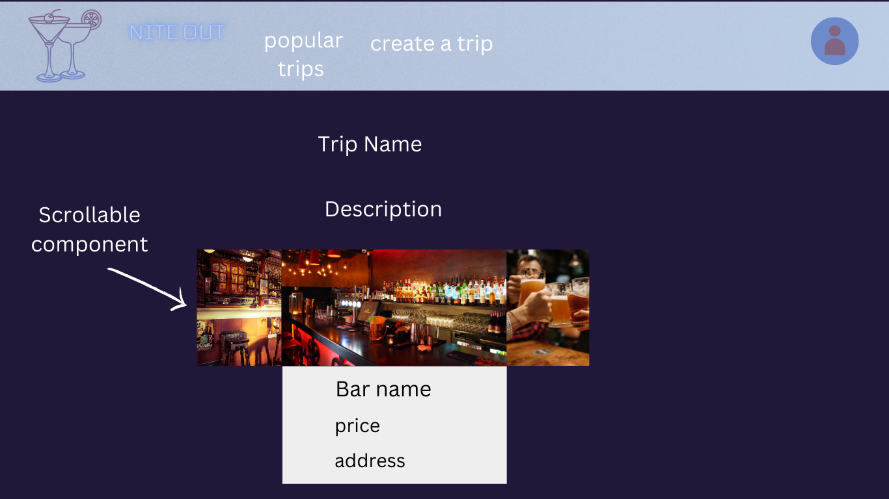
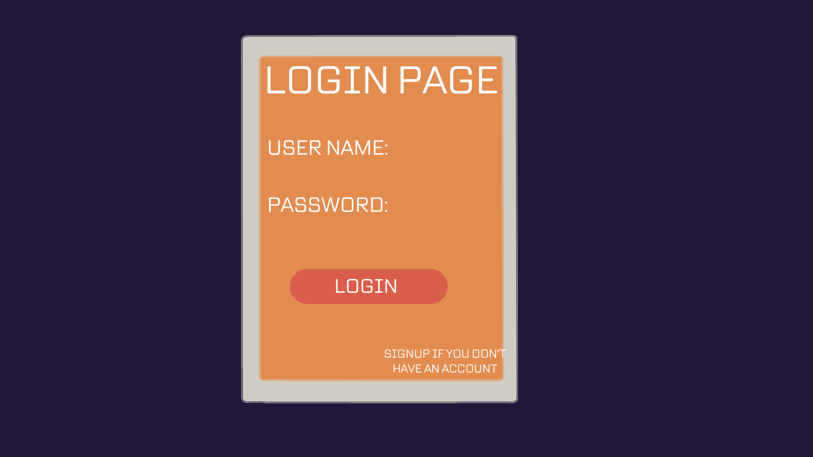

# User Graphical Human Interface

## Landing Page

This will be the landing page of our website. There will be a navigation bar with links to a list of the popular trips that others have made, as well as to the page that lets a user create a trip.

---

## Creation Page

This is the page for creating a trip. A user will enter the name of the trip, a description of the trip, and select different bars to add to their trip via an interactive map that shows the 20 nearest bars to the dropped marker.

---

## Popular Trips

This page shows a list of trips that other users have created, sorted by most likes. Each trip in the list will have the name of the trip, the description, an image from the first bar of that trip, and the number of likes. The list will automatically sort itself based on the number of likes it has.

---

## Trip Detail

This is the details page of a particular trip. It has the trip's name, description, each bar in the trip, and a button to edit the trip's details.

---

## Edit Trip

This is the page to edit a trip. A user can change the trip's name, the locations (adding, deleting, or rearranging the order of the bars in the trip), and the description. They can also delete the trip from this page.

---

## Login

This is the page where users will log in to their account. A user logs in with their unique username and their password.

---

## Sign Up

This is the page where users can make an account in order to start creating trips. To sign up, a user must pick a username, provide their email address, and choose a password.

